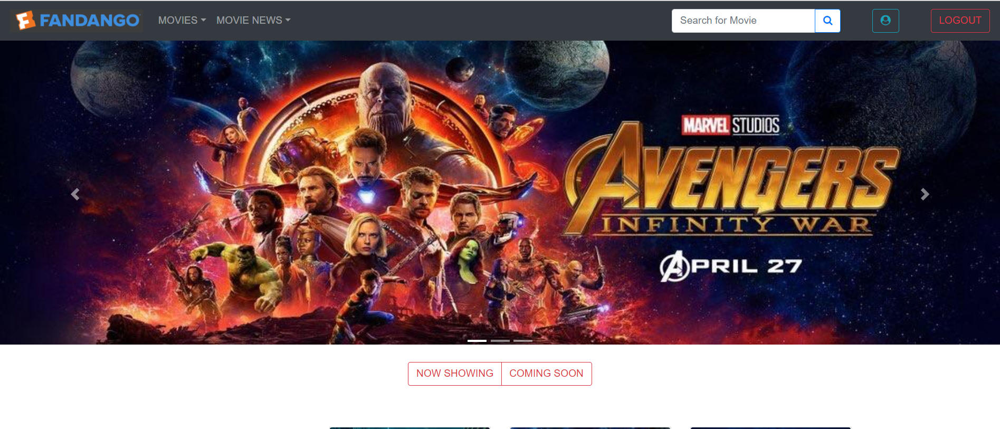

# Fndango Prototype




### Prerequisites

```
should have MongoDB, SQL, Redis, ReactJS, ExpressJS, NodeJS and Kafka installed in your system.
```
## Getting Started

### Start Zookeeper, Kafka and create topics
Follow the below steps
```
1. Start zookeeper - $KAFKA_HOME\bin\windows\zookeeper-server-start.bat  $KAFKA_HOME\config\zookeeper.properties
2. Start Kafka - $KAFKA_HOME\bin\windows\kafka-server-start.bat $KAFKA_HOME\config\server.properties
3. Create Topic - $KAFKA_HOME\bin\windows\kafka-topics.bat --create --zookeeper localhost:2181 --replication-factor 1 --partitions 1 --topic requestTopic
4.  Create Topic - $KAFKA_HOME\bin\windows\kafka-topics.bat --create --zookeeper localhost:2181 --replication-factor 1 --partitions 1 --topic responseTopic
```
### Start MongoDB
Follow the below steps
```
1. $MONGO_HOME\mongod.exe --dbpath "C:\data"
```

### Start Redis
Follow the below steps
```
1. $ redis-server
```

### Installing client side (running on 3000)

Follow the below steps
```
1. go to client folder
2. run command - npm start or yarn start
3. you can see the react console
```
### Installing Server side (running on 5000)

Follow the below steps
```
1. go to server folder
2. run command - yarn server
3. you can see the node console
```
### Installing Kafka Server side (running on 5000)

Follow the below steps
```
1. go to server folder
2. run command - yarn server
3. you can see the node console
```

### Running the Mocha test cases

Follow the below steps
```
1. go to server folder
2. run command - yarn test
3. you can see the mocha test results
```


